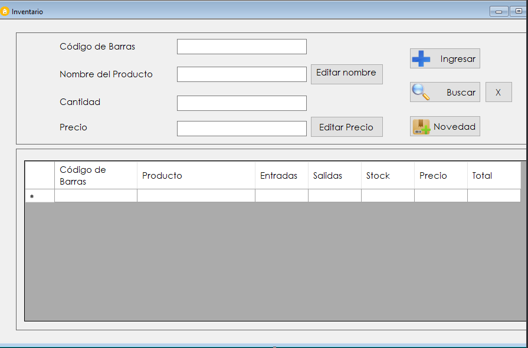

# Uso del marcado ligero o Markdown

## Carácter de escape
Para evitar que algunos parametro tengan efecto como marcado ligero en el código se utiliza backslash

## Salto de linea
El salto de linea cuando no se utiliza titulo o subtitulo se logra insertando 2 espacio y luego el enter.

## Comando en VS Code para la vista previa de un archivo de etiquetado ligero o Markdown
comando para ver el archivo de marcado ligero en VSCode en vivo Ctrl + Shift + V

## Encabezados
El signo # (numeral) y espacio al inicio permite definir el titulo y entre mayor cantidad de numerales se convierte en subtitulos.

## Subtitulo1
### Subtitulo2
#### Subtitulo3  
## Negrita
Parar esaltar en negrita se utiliza doble asterisco  
\*\*palabra negrita\*\*

**Resaltado en Negrita**

## Cita
Las citas se logran con el carácter de mayor que:
>Esto es una cita -El autor

## Links o Enlaces

Entre corchetes agregamos el texto que necesitemos y entre parentesis la url a donde queremos redireccionar.

\[enlace en línea](http://www.google.com)

Por ejemplo  
[Sintaxis Markdown Wikipedia](https://es.wikipedia.org/wiki/Markdown)  
[Sintaxis Markdown](https://markdown.es/sintaxis-markdown/#links)  
[Perfil de Github con ejemplo de README.md](https://github.com/anabelisam/readme.md#how-to-clone)

## Lista de elementos

La lista de elementos se realiza con guiones y en la visualización los toma como puntos:

- Elemento 1
- Elemento 2
- Elemento 3

## Lista de elementos numerados
Se logra anteponiendo el número un punto y un espacio antes de la descripción del elemento.
1. Elemento numerado 1
2. Elemento numerado 2
3. Elemento numerado 3
## Código
Se utiliza el acento grave para identificar código, y corchetes para identificar el lenguaje de programación

`Fragmento de código que se requiera añadir`

``` [language]
Código en 
varias líneas
```
Por ejemplo:
```bash
npm install
```

## Insertar Imagenes
Para insertar imagenes se realizar por medio de la siguiente sintaxis:
\!\[Texto alternativo\]\(/ruta_a_la_imagen.jpg\)

por ejemplo:


